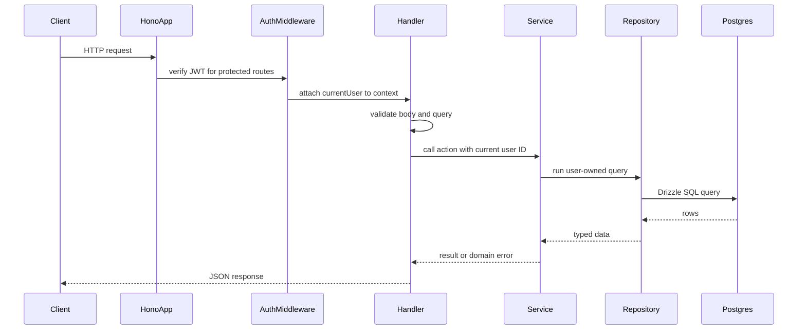

# Simplified Expense Tracker API plan

## Goal

Build the roadmap.sh Expense Tracker API with Hono, PostgreSQL, and Drizzle ORM. The API should let users sign up, log in, and manage only their own expenses. The main backend concepts to practice are JWT authentication, relational schema design, user-scoped queries, request validation, CRUD endpoints, and date range filtering.

The repo is currently empty apart from `[.gitignore](.gitignore)` and `[LICENSE](LICENSE)`, so we can keep the first version small and clean.

## Project scope

Build these required features:

- Sign up as a new user.
- Log in and receive a JWT.
- Protect expense endpoints with `Authorization: Bearer <token>`.
- Add a new expense.
- List expenses owned by the current user.
- Filter expenses by past week, past month, last 3 months, custom start/end dates, and category.
- Update an expense.
- Delete an expense.

Do not include accounts, budgets, transfers, refresh tokens, or analytics in the first version. Those are useful later, but they make the beginner project bigger than it needs to be.

## Architecture

Use a small modular TypeScript layout:

- `[src/index.ts](src/index.ts)` starts the server.
- `[src/app.ts](src/app.ts)` creates the Hono app, registers middleware, and mounts routes.
- `[src/config/env.ts](src/config/env.ts)` validates environment variables with Zod.
- `[src/db/client.ts](src/db/client.ts)` creates the PostgreSQL pool and Drizzle client.
- `[src/db/schema.ts](src/db/schema.ts)` defines the `users` and `expenses` tables.
- `[src/modules/auth/*](src/modules/auth)` handles sign up and login.
- `[src/modules/expenses/*](src/modules/expenses)` handles expense CRUD and filters.
- `[src/shared/*](src/shared)` contains auth middleware, errors, response helpers, and date helpers.

Each module should follow this shape:

- `routes.ts`: Hono route definitions.
- `handlers.ts`: request parsing and HTTP responses.
- `service.ts`: business rules.
- `repository.ts`: Drizzle queries.
- `schemas.ts`: Zod request and query validation.

Keep Drizzle queries out of route handlers. That one rule will make the project easier to test and reason about.

## Request flow

The important rule: protected services always receive the authenticated user's ID, and repository queries always include that ID. A user must never be able to read, update, or delete another user's expense by guessing an ID.

## Core data model

Start with only two tables:

- `users`: `id`, `name`, `email`, `passwordHash`, `createdAt`, `updatedAt`.
- `expenses`: `id`, `userId`, `title`, `amountCents`, `category`, `expenseDate`, `description`, `createdAt`, `updatedAt`.

Schema rules to practice:

- Store money as `amountCents`, not floating point numbers.
- Use `expenseDate` for the date the expense happened.
- Add `userId` to every user-owned table.
- Add a foreign key from `expenses.userId` to `users.id`.
- Add a unique index on `users.email`.
- Add an index on `expenses.userId`.
- Add a composite index on `expenses.userId` and `expenses.expenseDate` for date filters.
- Add an index on `expenses.userId` and `expenses.category` for category filters.

Use the roadmap category list as an enum-like value:

- `groceries`
- `leisure`
- `electronics`
- `utilities`
- `clothing`
- `health`
- `others`

## Functional requirements

Authentication:

- Register a user.
- Hash passwords before storing them.
- Log in with email and password.
- Return a signed JWT.
- Validate JWTs on protected endpoints.

Expenses:

- Create an expense with title, amount, category, date, and optional description.
- List only the authenticated user's expenses.
- Read one expense by ID.
- Update one expense by ID.
- Delete one expense by ID.
- Reject access if the expense does not belong to the authenticated user.

Filters:

- `period=past_week`
- `period=past_month`
- `period=last_3_months`
- `from=YYYY-MM-DD&to=YYYY-MM-DD` for custom ranges
- `category=groceries`
- Optional `page` and `limit` so list endpoints do not grow without bounds.

## Endpoint design

Use `/api/v1` for the project API.

Auth endpoints:

- `POST /api/v1/auth/register`
- `POST /api/v1/auth/login`

Protected expense endpoints:

- `POST /api/v1/expenses`
- `GET /api/v1/expenses`
- `GET /api/v1/expenses/:id`
- `PATCH /api/v1/expenses/:id`
- `DELETE /api/v1/expenses/:id`

Example filters:

- `GET /api/v1/expenses?period=past_week`
- `GET /api/v1/expenses?period=past_month`
- `GET /api/v1/expenses?period=last_3_months`
- `GET /api/v1/expenses?from=2026-06-01&to=2026-06-30`
- `GET /api/v1/expenses?category=groceries&page=1&limit=20`

Operational endpoints:

- `GET /health`

## Learning build order

1. Scaffold TypeScript, Hono, Drizzle, PostgreSQL config, and `GET /health`.
2. Add env validation for `DATABASE_URL`, `JWT_SECRET`, and `PORT`.
3. Create Drizzle schema and migrations for `users` and `expenses`.
4. Build `POST /api/v1/auth/register`.
5. Build `POST /api/v1/auth/login`.
6. Add JWT auth middleware.
7. Build expense CRUD.
8. Add date and category filters.
9. Add tests for auth, user ownership, CRUD, and filters.
10. Add a README with setup steps and endpoint examples.

## Defaults I recommend

- Runtime: Node.js with TypeScript.
- Web framework: Hono.
- Database: PostgreSQL.
- ORM: Drizzle ORM with Drizzle Kit migrations.
- Validation: Zod.
- Auth: JWT access token.
- Password hashing: Argon2 if available, otherwise bcrypt.
- Tests: Vitest for unit tests and integration tests.
- Money storage: `amountCents` as integer.
- Date filtering: calculate `past_week`, `past_month`, and `last_3_months` in the service layer; accept custom `from` and `to` dates as `YYYY-MM-DD`.

## Optional stretch work

After the roadmap project works, consider adding:

- Refresh tokens and logout.
- `GET /api/v1/users/me`.
- Expense summary totals by category.
- OpenAPI docs with `@hono/zod-openapi`.
- Docker Compose for local PostgreSQL.

These are intentionally outside the first milestone. Finish the small API first, then extend it.
